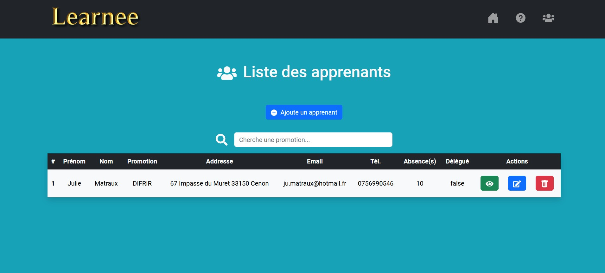

# Learnee 👥

Dans le cadre de la formation de développeur informatique, que je réalise au CESI de Bordeaux, j'ai dû réaliser une application permettant de gérer les apprenants de l'organisme de formation.

## Lien

La partie front-end de l'application est accessible à partir du lien suivant:
- [Front-end](https://github.com/kitaah/Learnee_backend)

## Fonctionnalités

- **Accès visiteur:** consulter la liste des apprenants (avec barre de recherche), ajouter, mettre à jour les données d'un apprenant ou en supprimer un.

## Langages

- **Front-end:** HTML, CSS, JavaScript (avec librairie d'icônes React-icons, d'animation AOS et utilisation du framework CSS Bootstrap)
- **Back-end:** Java (avec utilisation du framework Spring Boot)

## Outils

- **IDE:** IntelliJ IDEA
- **Librairie**: React
- **SGBD:** MariaDB
- **Manipulation d'API:** Postman
- **Gestion de version**: Git

&nbsp;&nbsp;&nbsp;&nbsp;&nbsp;&nbsp;&nbsp;&nbsp;&nbsp;&nbsp;&nbsp;&nbsp; &nbsp;&nbsp;&nbsp;&nbsp;&nbsp;&nbsp;

## Screenshot

 

